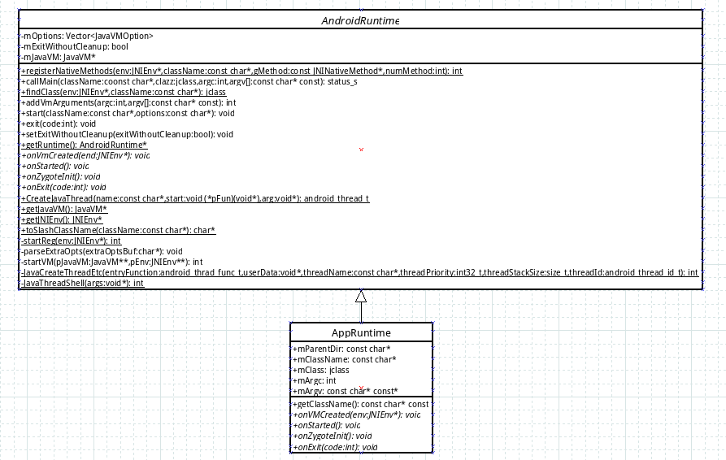
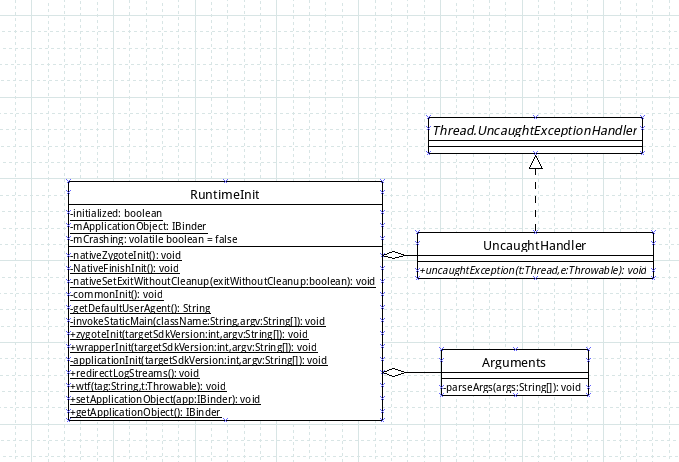
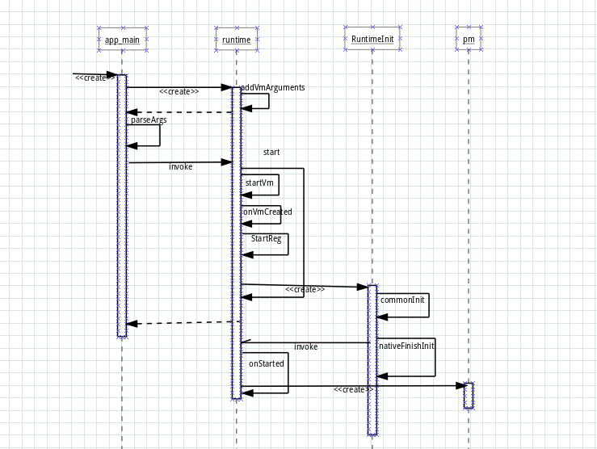

#####从pm命令执行细说AndroidRuntime启动
我们在PC端执行`adb shell pm package list`时，其实通过adb通信最终执行的是`system/bin`目录下的`pm`脚本。pm脚本内容如下

```shell
# Script to start "pm" on the device, which has a very rudimentary
# shell.
#
base=/system
export CLASSPATH=$base/framework/pm.jar
exec app_process $base/bin com.android.commands.pm.Pm "$@"
```

下面我们就从这个脚本展开
#####脚本本身
这个脚本前面两行主要是设置执行环境变量，也就是虚拟机环境，和各个`OS`的`PATH`是一个意思。这个脚本的重点在第三句`exec app_process $base/bin com.android.commands.pm.Pm "$@"`也就是执行`app_process`并且将后面的一串作为参数传入。其中`“$@”`是执行shell脚本时传入的参数。而`app_process`是一个可执行文件，位于`/system/bin`目录下。
#####app\_process
`app_process`入口源码是`app_main.cpp`。在`main`函数中首先会初始化一个`AppRuntime`。`AppRuntime`其实就是一个`AndroidRuntime`.下面就是main函数主体

```cpp
int main(int argc, char* const argv[])
{
   // ....
    // These are global variables in ProcessState.cpp
    mArgC = argc;
    mArgV = argv;
    mArgLen = 0;
    for (int i=0; i<argc; i++) {
        mArgLen += strlen(argv[i]) + 1;
    }
    mArgLen--;
    AppRuntime runtime;   //初始化一个AppRuntime
    const char* argv0 = argv[0];

    // Process command line arguments
    // ignore argv[0]  argv[0]在这里就是app_process
    argc--;
    argv++;
    // Everything up to '--' or first non '-' arg goes to the vm
    int i = runtime.addVmArguments(argc, argv); //将参数直接放入运行时环境
    // Parse runtime arguments.  Stop at first unrecognized option.
    //从下面的解析可以看出来在app_process后面可以带一些必须--开头的虚拟机参数带的参数主要是
    //--zygote表示启动Zygote进程，--start-system-server系统服务，--application应用，--nice-name进程名称。然后没有--第一个参数是parentDir,对应到pm启动脚本就是/system/bin.第二个从参数是虚拟机要启动的包名也就是com.android.commands.pm.Pm
    bool zygote = false;
    bool startSystemServer = false;
    bool application = false;
    const char* parentDir = NULL;
    const char* niceName = NULL;
    const char* className = NULL;
    while (i < argc) {
        const char* arg = argv[i++];
        if (!parentDir) {
            parentDir = arg;
        } else if (strcmp(arg, "--zygote") == 0) {
            zygote = true;
            niceName = "zygote";
        } else if (strcmp(arg, "--start-system-server") == 0) {
            startSystemServer = true;
        } else if (strcmp(arg, "--application") == 0) {
            application = true;
        } else if (strncmp(arg, "--nice-name=", 12) == 0) {
            niceName = arg + 12;
        } else {
            className = arg;
            break;
        }
    }
    if (niceName && *niceName) {
        setArgv0(argv0, niceName);
        set_process_name(niceName);
    }
    runtime.mParentDir = parentDir;//目前没发现这个目录干什么用
    //根据解析来决定启动的进程是什么。对于pm当然是走 else if分支。
    //请留意，在这里启动了另外一个进程虚拟机进程com.android.internal.os.RuntimeInit.
    if (zygote) {
        runtime.start("com.android.internal.os.ZygoteInit",
                startSystemServer ? "start-system-server" : "");
    } else if (className) {
        // Remainder of args get passed to startup class main()
        runtime.mClassName = className;
        runtime.mArgC = argc - i;
        runtime.mArgV = argv + i;
        runtime.start("com.android.internal.os.RuntimeInit",
                application ? "application" : "tool");
    } else {
        fprintf(stderr, "Error: no class name or --zygote supplied.\n");
        app_usage();
        LOG_ALWAYS_FATAL("app_process: no class name or --zygote supplied.");
        return 10;
    }
}
```
#####AndroidRuntime
从上面的代码来看，这里主要是初始化`AppRuntime`。然后启动`com.android.internal.os.RuntimeInit`虚拟机进程，其实就是Android进程的孵化器，当然称作初始化Android运行时更恰当。启动的代码如下。

```cpp
void AndroidRuntime::start(const char* className, const char* options)
{

	//.....
    //这里虚拟机
    //....
    //对参数进行判断，决定启动什么进程
    //.....
    //下面就是初始化并启动Java虚拟机了
    JniInvocation jni_invocation;
    jni_invocation.Init(NULL);
    JNIEnv* env;
    if (startVm(&mJavaVM, &env) != 0) {
        return;
    }
    onVmCreated(env);
   	//讲与android相关的JNI接口注册到Java虚拟机。方便孵化器启动Android进程。因为孵化器需要使用到Android自己需要的JNI接口。这里科一看下startReg实现，我就不详述了。里面主要使用到了一个gRegJNI数组，这个数组是一个函数指针，和每个android底层需要注册JNI的类对应。通过循环这个数组执行指针函数进行注册。
    if (startReg(env) < 0) {
        ALOGE("Unable to register all android natives\n");
        return;
    }
	//这个下面就是启动孵化器ZygoteInit或是RuntimeInit.具体参考app_main.cpp中main函数结尾启动部分。
    //....
    //准备孵化器启动参数
    //....
	//将孵化器class的点转化成反斜杠
    char* slashClassName = toSlashClassName(className);
    jclass startClass = env->FindClass(slashClassName);
    if (startClass == NULL) {
        ALOGE("JavaVM unable to locate class '%s'\n", slashClassName);
        /* keep going */
    } else {
        //在类中寻找main方法
        jmethodID startMeth = env->GetStaticMethodID(startClass, "main",
            "([Ljava/lang/String;)V");
        if (startMeth == NULL) {
            ALOGE("JavaVM unable to find main() in '%s'\n", className);
            /* keep going */
        } else {
        //执行main方法。当然针对pm流程来看，这里就是启动RuntimeInit的main方法。
            env->CallStaticVoidMethod(startClass, startMeth, strArray);
        }
    }
    free(slashClassName);
   //....
}
```

在这里必须要理一下`AppRuntime`和`AndroidRuntime`的关系。`uml`类图关系如下

从图看以看出AppRuntime继承了AndroidRuntime。并且实现了AndroidRuntime的一些方法，当然在这里主要需要关注下那几个回调函数，也就是`on`开头的函数，也就是`onVmCreated` `onStarted` `onZygoteInit` `onExit`特别是`onStarted`是纯虚函数。其他几个都是空实现。上面说到了启动了RuntimeInit进程。那这个进程在干什么呢？
#####RuntimeInit
这里还是先梳理下这个类结构

其中有三个本地方法就是`nativeZygoteInit` `nativeFinishInit` `ativeSetExitWithoutCleanup`。通过前面的介绍其实前两个函数在这个启动流程中意义是一样的，只是在不同分支或是根据启动的进程不一样来执行不一样的函数。这几个函数注册在上面介绍过的`startReg`函数中完成，对应的回调函数是`register_com_android_internal_os_RuntimeInit`。

```cpp
static JNINativeMethod gMethods[] = {
    { "nativeFinishInit", "()V",
        (void*) com_android_internal_os_RuntimeInit_nativeFinishInit },
    { "nativeZygoteInit", "()V",
        (void*) com_android_internal_os_RuntimeInit_nativeZygoteInit },
    { "nativeSetExitWithoutCleanup", "(Z)V",
        (void*) com_android_internal_os_RuntimeInit_nativeSetExitWithoutCleanup },
};

int register_com_android_internal_os_RuntimeInit(JNIEnv* env)
{
    return jniRegisterNativeMethods(env, "com/android/internal/os/RuntimeInit",
        gMethods, NELEM(gMethods));
}
```

那RuntimeInit的main函数在做什么呢,这个在`RuntimeInit.java`件中。

```java
public static final void main(String[] argv) {
		//这个参数还记得吗，是在app_main的runtime.start时候传过来的
        if (argv.length == 2 && argv[1].equals("application")) {
            if (DEBUG) Slog.d(TAG, "RuntimeInit: Starting application");
            redirectLogStreams();
        } else {
            if (DEBUG) Slog.d(TAG, "RuntimeInit: Starting tool");
        }
        commonInit();
        nativeFinishInit();
}
```
这里就做一件事，通用初始化`commonInit`，我暂时还不知道这在干么，如果有知道的可以告诉我。然后执行`nativeFinishInit`。这个根据上面的注册可知其实调用`AndroidRuntime`的`com_android_internal_os_RuntimeInit_nativeFinishInit`方法。这个方法调用`AndroidRuntime` 的 `onSatrted`方法，也就是调回runtime实例。然后回`AppRuntime`的`onstarted`，这个gCurRuntime是在构造`runtime`是创建的，其实就是保存的一个`runtime`的指针

```cpp
static void com_android_internal_os_RuntimeInit_nativeFinishInit(JNIEnv* env, jobject clazz)
{
    gCurRuntime->onStarted();
}
```

那么在`onStarted`中在做什么呢,这是个回调函数

```cpp
 virtual void onStarted()
 {
        sp<ProcessState> proc = ProcessState::self();
        ALOGV("App process: starting thread pool.\n");
        proc->startThreadPool();
        AndroidRuntime* ar = AndroidRuntime::getRuntime();
        ar->callMain(mClassName, mClass, mArgC, mArgV);
        IPCThreadState::self()->stopProcess();
 }
```
这里的`mClassName`是在`app_main`解析参数的时候保存的。也就是这个实例中的`android.commands.pm.Pm`，`mClass`就是注册虚拟机后的实例，在`onVmCreated`中绑定。通过`callMain`从而调用`pm`，这些参数随之传入`Pm`的`main`函数，从而启动了`pm list package`功能。`pm`的代码实现在`Pm.java`中。在这里运行时启动分析完成了。至于`pm`如何实现的请自行学习。下面来来一张总体调用时序图

